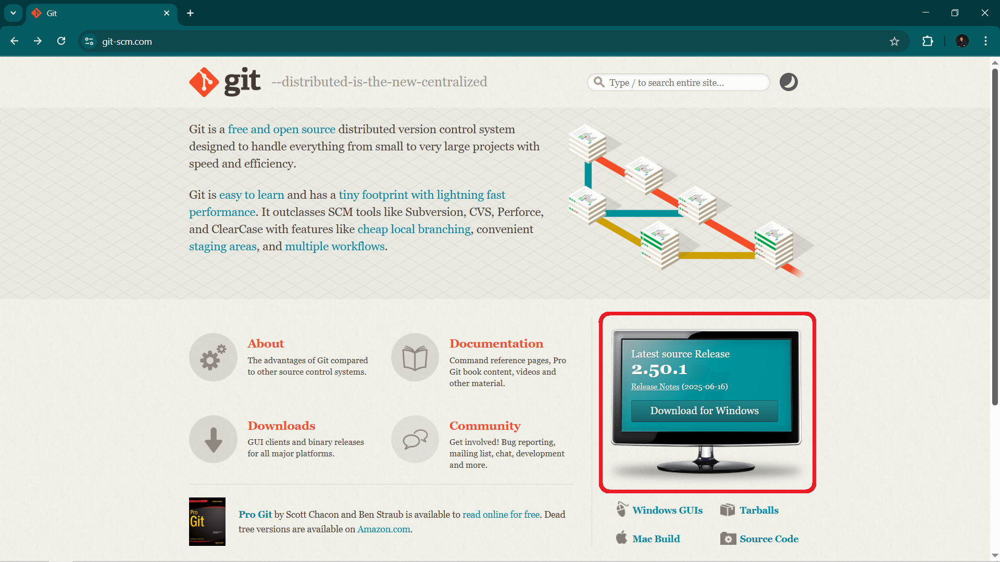
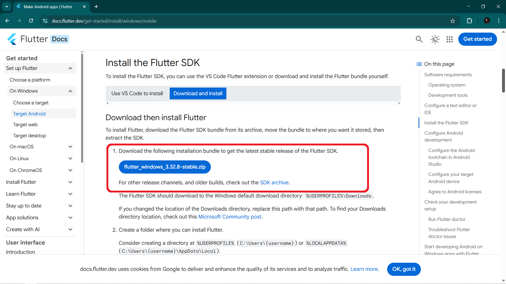
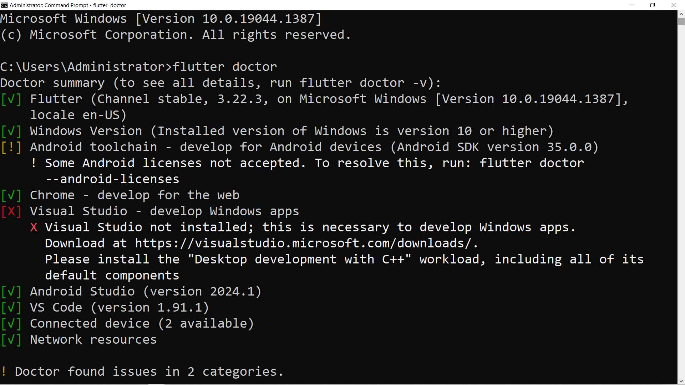
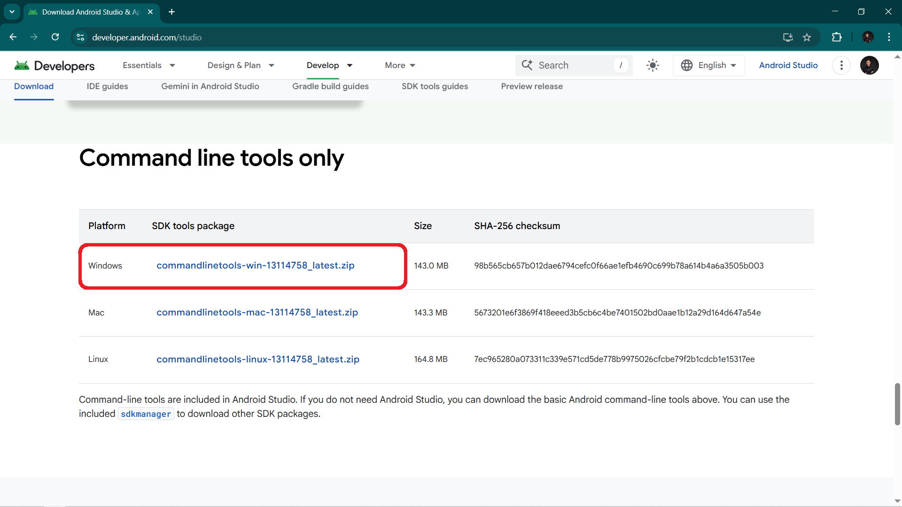

# Panduan Lengkap Instalasi Flutter dengan Emulator (Tanpa Android Studio) di Windows dan Git, Visual Studio Code (Versi Terbaru 2025)

Oleh: Manus AI

## Pendahuluan

Panduan ini akan memandu Anda melalui proses instalasi Flutter SDK, konfigurasi lingkungan pengembangan, serta menyiapkan emulator Android di sistem operasi Windows, tanpa perlu menginstal Android Studio yang memakan banyak ruang. Kami juga akan membahas instalasi Git dan Visual Studio Code, dua alat penting dalam pengembangan Flutter. Panduan ini dirancang untuk versi terbaru tahun 2025, memastikan Anda mendapatkan informasi yang paling relevan dan mutakhir.

Flutter adalah UI toolkit dari Google untuk membangun aplikasi yang dikompilasi secara _natively_ untuk _mobile_, _web_, dan _desktop_ dari satu _codebase_. Dengan Flutter, Anda dapat membuat aplikasi yang indah dan berperforma tinggi dengan cepat. Untuk memulai pengembangan Flutter, Anda memerlukan lingkungan yang tepat, dan panduan ini akan membantu Anda menyiapkannya langkah demi langkah.

## Prasyarat Sistem

Sebelum memulai instalasi, pastikan sistem Anda memenuhi prasyarat berikut:

*   **Sistem Operasi:** Windows 10 atau versi yang lebih baru (64-bit).
*   **Ruang Disk:** Minimal 10 GB ruang disk kosong untuk Flutter SDK dan Android SDK.
*   **Koneksi Internet:** Koneksi internet yang stabil untuk mengunduh file-file yang diperlukan.


## 1. Instalasi Git

Git adalah sistem kontrol versi terdistribusi yang sangat penting dalam pengembangan perangkat lunak, termasuk Flutter. Anda akan menggunakannya untuk mengelola versi kode Anda dan juga untuk mengunduh Flutter SDK itu sendiri. [1]

### Langkah-langkah Instalasi Git:

1.  **Unduh Git for Windows:**
    Kunjungi situs resmi Git for Windows di `https://git-scm.com/` dan unduh versi terbaru yang sesuai dengan sistem operasi Anda. !
    <!-- [Git for Windows](img/git.png) -->
    

2.  **Jalankan Installer:**
    Setelah selesai mengunduh, jalankan file installer (`.exe`). Ikuti petunjuk instalasi. Disarankan untuk menggunakan pengaturan default kecuali Anda memiliki kebutuhan khusus. Pastikan opsi "Git Bash Here" dan "Git GUI Here" dicentang untuk kemudahan akses.

3.  **Konfigurasi PATH:**
    Selama instalasi, pastikan Anda memilih opsi untuk menambahkan Git ke PATH sistem Anda. Ini akan memungkinkan Anda menjalankan perintah Git dari Command Prompt atau PowerShell mana pun.

4.  **Verifikasi Instalasi:**
    Buka Command Prompt atau PowerShell baru dan ketik perintah berikut:
    ```bash

    git --version
    ```
    Jika instalasi berhasil, Anda akan melihat versi Git yang terinstal.


## 2. Instalasi Flutter SDK

Ada dua cara utama untuk menginstal Flutter SDK: melalui ekstensi VS Code atau mengunduh bundel Flutter secara manual. Kami akan fokus pada metode manual karena panduan ini bertujuan untuk memberikan kontrol lebih.

### Langkah-langkah Instalasi Flutter SDK (Manual):

1.  **Unduh Flutter SDK:**
    Kunjungi halaman unduhan resmi Flutter SDK untuk Windows di `https://docs.flutter.dev/get-started/install/windows/mobile`. Unduh file `.zip` versi stabil terbaru. 
    
      

2.  **Ekstrak File:**
    Ekstrak file `.zip` yang telah diunduh ke lokasi yang mudah diakses di komputer Anda, misalnya `C:\src\flutter` atau `C:\flutter`. Pastikan jalur tidak mengandung karakter khusus atau spasi. Contoh: `C:\flutter`.

3.  **Tambahkan Flutter ke PATH Lingkungan:**
    Untuk dapat menjalankan perintah Flutter dari terminal mana pun, Anda perlu menambahkan direktori `bin` dari Flutter SDK ke variabel lingkungan PATH sistem Anda.
    *   Cari "Edit the system environment variables" di Start Menu Windows dan buka.
    *   Klik tombol "Environment Variables...".
    *   Di bagian "System variables", cari variabel bernama `Path`, lalu klik "Edit...".
    *   Klik "New" dan tambahkan jalur ke folder `bin` di dalam direktori Flutter Anda (misalnya, `C:\flutter\bin`).
    *   Klik "OK" di semua jendela untuk menyimpan perubahan.

4.  **Verifikasi Instalasi Flutter:**
    Buka Command Prompt atau PowerShell baru (penting untuk membuka yang baru agar perubahan PATH diterapkan) dan jalankan perintah berikut:
    ```bash

    flutter doctor
    ```
    Perintah ini akan memeriksa lingkungan Anda dan menampilkan laporan tentang status instalasi Flutter Anda. Ini akan menunjukkan apakah ada komponen yang hilang atau perlu dikonfigurasi lebih lanjut. !
    
    


## 3. Instalasi Android Command-line Tools dan Emulator (Tanpa Android Studio)

Untuk menjalankan aplikasi Flutter di emulator Android tanpa menginstal Android Studio secara penuh, Anda hanya perlu menginstal Android Command-line Tools dan menyiapkan emulator secara manual. [2]

### Langkah-langkah Instalasi Android Command-line Tools:

1.  **Unduh Android Command-line Tools:**
    Kunjungi halaman unduhan Android Studio di `https://developer.android.com/studio#command-tools`. Gulir ke bawah ke bagian "Command line tools only" dan unduh file `.zip` untuk Windows.

    

2.  **Buat Struktur Folder:**
    Buat folder baru di lokasi yang mudah diakses, misalnya `C:\Android\cmdline-tools`. Ekstrak isi file `.zip` yang telah diunduh ke dalam folder ini. Pastikan struktur folder akhirnya adalah `C:\Android\cmdline-tools\latest` (atau versi yang sesuai). Ini penting karena `sdkmanager` mencari folder `latest`.

3.  **Tambahkan Android SDK ke PATH Lingkungan:**
    Mirip dengan Flutter, Anda perlu menambahkan jalur ke `bin` dari Android Command-line Tools ke variabel lingkungan PATH Anda. Tambahkan `C:\Android\cmdline-tools\latest\bin` ke variabel PATH sistem Anda.

4.  **Instal Platform-Tools dan Platform Android:**
    Buka Command Prompt atau PowerShell baru dan jalankan perintah berikut untuk menginstal `platform-tools` (yang berisi `adb` dan `fastboot`) dan platform Android terbaru (misalnya, `android-34`):
    ```bash

    sdkmanager "platform-tools" "platforms;android-34"
    ```
    Anda mungkin perlu menerima lisensi Android. Jika diminta, ketik `y` dan tekan Enter.

5.  **Tambahkan Platform-Tools ke PATH Lingkungan:**
    Setelah `platform-tools` diinstal, Anda perlu menambahkan jalurnya ke variabel PATH Anda. Jalur ini biasanya `C:\Android\platform-tools`. Tambahkan ini ke variabel PATH sistem Anda.

### Menyiapkan Emulator Android (AVD):

1.  **Instal Gambar Sistem (System Image):**
    Pilih gambar sistem yang ingin Anda gunakan untuk emulator Anda. Anda dapat melihat daftar gambar sistem yang tersedia dengan perintah:
    ```bash

    sdkmanager --list
    ```
    Setelah memilih, instal gambar sistem yang diinginkan, misalnya untuk Android 34 (API Level 34) dengan arsitektur `x86_64`:
    ```bash

    sdkmanager "system-images;android-34;google_apis;x86_64"
    ```
    

2.  **Buat Perangkat Virtual Android (AVD):**
    Gunakan perintah `avdmanager` untuk membuat AVD baru. Misalnya, untuk membuat AVD bernama `MyFlutterEmulator` dengan gambar sistem yang baru diinstal:
    ```bash

    avdmanager create avd -n MyFlutterEmulator -k "system-images;android-34;google_apis;x86_64"
    ```
    Anda mungkin akan diminta untuk mengkonfirmasi beberapa pengaturan. Tekan Enter untuk menggunakan nilai default atau masukkan nilai yang Anda inginkan. 

3.  **Jalankan Emulator:**
    Anda dapat menjalankan emulator dari Command Prompt atau PowerShell dengan perintah:
    ```bash

    emulator -avd MyFlutterEmulator
    ```
    Ganti `MyFlutterEmulator` dengan nama AVD yang Anda buat. 

4.  **Terima Lisensi Android:**
    Setelah semua komponen terinstal, jalankan `flutter doctor --android-licenses` untuk menerima semua lisensi Android yang diperlukan. Ini penting agar Flutter dapat menggunakan SDK Android dengan benar.


## 4. Instalasi Visual Studio Code dan Ekstensi Flutter

Visual Studio Code (VS Code) adalah editor kode ringan namun kuat yang sangat direkomendasikan untuk pengembangan Flutter. [3]

### Langkah-langkah Instalasi Visual Studio Code:

1.  **Unduh Visual Studio Code:**
    Kunjungi situs resmi Visual Studio Code di `https://code.visualstudio.com/` dan unduh installer untuk Windows.

2.  **Jalankan Installer:**
    Jalankan file installer (`.exe`). Ikuti petunjuk instalasi. Disarankan untuk mencentang opsi "Add 'Open with Code' action to Windows Explorer file context menu" dan "Add 'Open with Code' action to Windows Explorer directory context menu" untuk kemudahan akses.

### Instalasi Ekstensi Flutter dan Dart di VS Code:

1.  **Buka VS Code:**
    Setelah instalasi selesai, buka Visual Studio Code.

2.  **Buka Extensions View:**
    Klik ikon Extensions di Activity Bar di sisi kiri (terlihat seperti empat kotak) atau tekan `Ctrl+Shift+X`.

3.  **Cari dan Instal Ekstensi Flutter:**
    Di kolom pencarian Extensions Marketplace, ketik "Flutter". Cari ekstensi "Flutter" yang diterbitkan oleh Dart Code. Klik "Install". Ekstensi Dart akan diinstal secara otomatis sebagai dependensi. 

4.  **Verifikasi Instalasi Ekstensi:**
    Setelah instalasi selesai, Anda dapat memverifikasi bahwa ekstensi telah terinstal dengan benar dengan membuka Command Palette (`Ctrl+Shift+P`), ketik `flutter` dan Anda akan melihat berbagai perintah Flutter yang tersedia.


## 5. Membuat dan Menjalankan Proyek Flutter Pertama Anda

Setelah semua komponen terinstal dan terkonfigurasi, Anda siap untuk membuat aplikasi Flutter pertama Anda.

### Langkah-langkah Membuat Proyek Flutter:

1.  **Buka Command Prompt/PowerShell atau Terminal VS Code:**
    Pastikan Anda berada di direktori tempat Anda ingin membuat proyek baru.

2.  **Buat Proyek Baru:**
    Jalankan perintah berikut:
    ```bash

    flutter create my_first_app
    ```
    Ganti `my_first_app` dengan nama proyek yang Anda inginkan. Flutter akan membuat struktur proyek dasar untuk Anda.

3.  **Masuk ke Direktori Proyek:**
    ```bash

    cd my_first_app
    ```

### Menjalankan Aplikasi Flutter:

1.  **Pastikan Emulator Berjalan:**
    Sebelum menjalankan aplikasi, pastikan emulator Android Anda sudah berjalan. Jika belum, jalankan dengan perintah:
    ```bash

    emulator -avd MyFlutterEmulator
    ```
    (Ganti `MyFlutterEmulator` dengan nama AVD Anda).

2.  **Jalankan Aplikasi:**
    Di dalam direktori proyek Anda, jalankan perintah:
    ```bash

    flutter run
    ```
    Flutter akan mendeteksi emulator yang berjalan dan meluncurkan aplikasi Anda di sana. Jika ada beberapa perangkat yang terhubung (misalnya, emulator dan browser), Flutter akan meminta Anda memilih perangkat target.

    Anda juga dapat menjalankan aplikasi di browser (untuk pengembangan web) dengan:
    ```bash

    flutter run -d chrome
    ```


## Kesimpulan

Dengan mengikuti panduan ini, Anda seharusnya telah berhasil menginstal Flutter SDK, Git, Visual Studio Code, dan menyiapkan emulator Android tanpa perlu menginstal Android Studio secara penuh. Anda kini memiliki lingkungan pengembangan yang lengkap untuk mulai membangun aplikasi _cross-platform_ yang menakjubkan dengan Flutter.

Pastikan untuk selalu memeriksa dokumentasi resmi Flutter untuk pembaruan dan informasi lebih lanjut, karena ekosistem pengembangan terus berkembang.

Selamat mengembangkan aplikasi Flutter!

## Referensi

[1] Git for Windows. `https://gitforwindows.org/`
[2] Android Developers. Download Android Studio & App Tools. `https://developer.android.com/studio#command-tools`
[3] Visual Studio Code. `https://code.visualstudio.com/`


