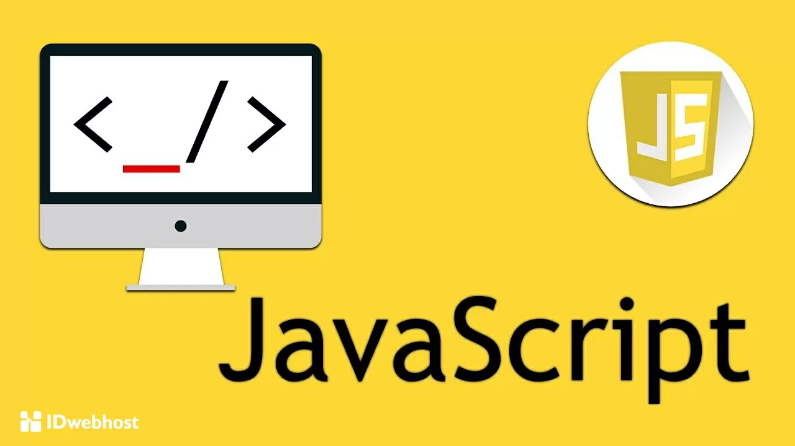

# Pengantar JavaScript

Terlepas dari namanya, JavaScript hanya terkait secara kebetulan dengan Java karena keduanya berbagi beberapa kemiripan sintaksis. Sintaks JavaScript pada pengembangan awalnya adalah terinspirasi dari sintaks Java dan itu disebut "LiveScript" saat pertama kali diluncurkan dalam versi beta dari Netscape Navigator pada tahun 1995, untuk penawaran lain dari Netscape dan sebagai anggukan atas fakta bahwa Netscape menjalankan "live" pada browser. Microsoft merilis implementasi JavaScript mereka sendiri, "JScript", kemudian dengan Internet Explorer 3.0.

Netscape mengirimkan karya awal ini kepada Ecma International, organisasi yang mengembangkan dan menerbitkan standar teknis, untuk memformalkan dan merinci bagaimana bahasa skrip harus dipahami oleh browser lain. Pada tahun 1997, Ecma International merilis ECMA-262, yang menstandarkan versi pertama pembuatan skrip bahasa yang disebut ECMAScript. ECMAScript adalah standar yang menginformasikan pembuatan bahasa scripting yang lebih spesifik, misalnya, hasil kerja Microsoft kemudian pada now-defunct JScript, Adobe'sRules, dan JavaScript itu sendiri.

Perbedaan ini penting ketika membahas aspek dan fitur khusus dari pada JavaScript. "ES5" akan merujuk pada peristiwa utama pertama rilis ECMAScript standar pada tahun 2009, setelah itu standar telah diperbarui setiap tahun sejak 2015. Versi terbaru dari standar ECMAScript adalah "ES2023", yang dirilis pada Juni 2023.

## Aturan dasar

### Statements

Statements (Pernyataan) adalah instruksi yang dilakukan oleh program. Dalam JavaScript, pernyataan diakhiri dengan titik koma. Misalnya:

```javascript

let x = 10;
let y = 20;
let z = x + y;
```

### Expressions

Ekspresi adalah unit kode yang menghasilkan nilai, dan karenanya dapat digunakan di mana pun nilai diharapkan. `2 + 2` adalah ekspresi yang menghasilkan nilai `4`:

```javascript

2 + 2;
// > 4
```

“Operator pengelompokan”, sepasang tanda kurung yang melingkupinya, digunakan untuk mengelompokkan bagian ekspresi untuk memastikan bahwa sebagian dari ekspresi itu dievaluasi sebagai unit tunggal. Misalnya, Anda dapat menggunakan operator pengelompokan untuk mengganti urutan operasi matematika, atau untuk meningkatkan keterbacaan kode:

```javascript

2 + 2 * 4;
// > 10

(2 + 2) * 4;
// > 16

let myVariable = (2 + 2);

myVariable;
// > 4
```

### Weak typing

JavaScript adalah bahasa yang diketik secara lemah (loosely typed) atau dinamis. Ini berarti Anda tidak perlu mendeklarasikan tipe data variabel saat Anda membuatnya, dan tipe data dapat berubah selama eksekusi program. Misalnya:

```javascript

let a = 10; // a adalah angka
a = "hello"; // sekarang a adalah string
```

### Case sensitivity (Kepekaan huruf besar/kecil)

JavaScript adalah bahasa yang peka huruf besar/kecil (case-sensitive). Ini berarti `myVariable` dan `myvariable` adalah dua variabel yang berbeda. Misalnya:

```javascript

let myVariable = 10;
let myvariable = 20;

console.log(myVariable); // Output: 10
console.log(myvariable); // Output: 20
```

### Whitespace (Spasi kosong)

Spasi kosong (whitespace) seperti spasi, tab, dan baris baru sebagian besar diabaikan oleh JavaScript. Ini berarti Anda dapat memformat kode Anda agar mudah dibaca tanpa memengaruhi fungsionalitasnya. Misalnya:

```javascript

let x = 10;
let y = 20;

// Sama dengan:
let x=10;let y=20;
```


# Tipe dan struktur data

Primitif adalah jenis data paling sederhana di JavaScript. Literal dasar adalah nilai, tanpa wrapper atau propertinya sendiri. Literal primitif bersifat tidak dapat diubah, artinya tidak dapat diubah untuk mewakili nilai lain dengan cara yang sama seperti yang dilakukan struktur data berbasis objek JavaScript yang lebih kompleks. Misalnya, meskipun nilai variabel bernama `theTruth` dapat ditetapkan ulang ke nilai `false`, literal boolean `true` tidak pernah dapat merepresentasikan nilai apa pun selain `true`, sama halnya dengan `5` literal angka tidak pernah dapat merepresentasikan nilai angka lain.

Ada tujuh jenis data primitif:

*   Angka
*   String
*   Boolean
*   `null`
*   `undefined`
*   BigInt
*   Simbol

Untuk informasi tentang jenis data yang lebih kompleks, lihat Variabel.

# Angka

Nilai angka terdiri dari serangkaian karakter numerik apa pun, misalnya:

```
5
```

Jenis data angka juga mencakup beberapa properti global khusus yang mewakili konsep numerik, seperti `Infinity` dan `NaN`—nilai yang berarti "bukan angka," hasil yang mungkin dicapai dari percobaan perhitungan pada nilai non-angka.

## Objek angka

Saat nilai diteruskan ke fungsi `Number()`, nilai tersebut akan dikonversi menjadi setara dengan angkanya. Misalnya, suatu string numerik menghasilkan nilai yang setara dengan primitif angka:

```javascript

Number( "10" );
// > 10
```

Meneruskan nilai `false` atau `null` ke `Number()` akan menampilkan `0`, dan `true` akan menampilkan `1`.

```javascript

Number( null );
// > 0

Number( false );
// > 0

Number( true );
// > 1
```

Jika nilai tidak dapat dikonversi, seperti dalam kasus `undefined` atau string yang berisi karakter non-numerik, fungsi `Number` akan menampilkan `NaN`:

```javascript

Number( undefined );
// > NaN

Number( "The number 3." );
// > NaN
```

Anda mungkin akan memiliki sedikit atau tidak ada alasan untuk menggunakan objek `Number` sebagai konstruktor, karena membuat _objek_ `Number`, bukan literal angka.

```javascript

let numObject = new Number( 15 );

numObject;
// > Number { 15 }
```

Objek ini berperilaku seperti nilai yang ditetapkan untuk operasi matematika, tetapi gagal dalam perbandingan persamaan yang ketat terhadap literal angka, karena jenis data tidak cocok, tanpa memberikan manfaat praktis apa pun dibandingkan nilai literal.

```javascript

let tenObject = new Number( 10 );

tenObject + 5;
// > 15

tenObject === 10;
// > false
```

## Float dan bilangan bulat

JavaScript hanya memiliki satu jenis angka: [IEEE 754-1985 presisi ganda 64-bit bilangan floating point](https://en.wikipedia.org/wiki/Double-precision_floating-point_format) di antara `-2^1024` dan `2^1024`. Sebelum JavaScript menyimpan angka apa pun di memori, JavaScript mengonversi bilangan tersebut menjadi bilangan floating point biner, yang juga disebut _float_.

Penyimpanan 64-bit ini (satu bit “tanda” positif atau negatif, 11 bit untuk eksponen, dan 52 bit untuk pecahan) dapat menyebabkan error presisi dengan angka berapa pun yang tidak sesuai dengan rentang yang diizinkan. Keterbatasan ini melekat ke jenis data angka JavaScript.

```javascript

0.1 + 0.7
// > 0.7999999999999999
```

Nilai angka dapat disimpan sebagai _bilangan bulat_, yaitu angka floating point tanpa pecahan antara `-(2^53 − 1)` dan `2^53 − 1`. Karena float dan bilangan bulat disimpan dengan cara mendasar yang sama, tidak ada perbedaan praktis dalam cara angka-angka ini beroperasi. Namun, sebaiknya gunakan bilangan bulat setiap kali mungkin untuk menghindari kesalahan presisi.

## Operator angka

Ketika Anda menggunakan operator matematika standar dengan primitif angka, [urutan operasi](https://en.wikipedia.org/wiki/Order_of_operations) matematika berlaku: setiap ekspresi yang digabungkan dalam tanda kurung dievaluasi terlebih dahulu, diikuti dengan eksponen, perkalian, pembagian, penambahan, dan pengurangan.

| Operator | Nama | Deskripsi | Penggunaan | Hasil |
| --- | --- | --- | --- | --- |
| `+` | Penambahan | `2+2` | `4` |
| `-` | Pengurangan | `4-2` | `2` |
| `*` | Perkalian | `2*5` | `10` |
| `/` | Pembagian | `10/5` | `2` |
| `++` | Penambahan | Menambahkan satu ke nomor | `2++` | `3` |
| `--` | Pengurangan | Mengurangi satu dari angka | `3--` | `2` |
| `**` | Eksponen | Menampilkan hasil peningkatan pertama operand ke pangkat operand kedua. | `2**4` | `16` |
| `%` | Pengingat | Menampilkan sisa yang tersisa saat operand pertama dibagi dengan operand kedua. | `12%5` | `2` |

Anda juga dapat menggunakan operator penugasan matematika untuk mengerjakan pada nilai suatu variabel dan segera menetapkan nilai yang baru dihitung ke variabel tersebut.

| Operator | Nama | Penggunaan |
| --- | --- | --- |
| `+=` | Penetapan penambahan | `myValue += 2` |
| `-=` | Penetapan pengurangan | `myValue -= 2` |
| `*=` | Penetapan perkalian | `myValue *= 2` |
| `/=` | Penetapan pembagian | `myValue /= 2` |
| `**=` | Penetapan eksponen | `myValue **= 2` |
| `%=` | Penetapan tersisa | `myValue %= 2` |

## Nilai simbolis

Primitif angka juga berlaku untuk beberapa kasus khusus: "bukan angka" nilai (`NaN`) dan nilai yang mewakili tak terhingga yang bisa bernilai positif (`Infinity`) atau negatif (`-Infinity`).

Anda mungkin jarang menemukan `Infinity` sebagai hasil pembagian dengan nol, kasus di mana sebagian besar bahasa pemrograman menampilkan error:

```javascript

10 / 0
// > Infinity
```

Ingat bahwa JavaScript peka huruf besar/kecil. `Infinity` adalah jenis data angka merepresentasikan konsep tak terhingga, tetapi `infinity` tidak memiliki arti khusus:

```javascript

Infinity
// > Infinity

infinity
// > Uncaught ReferenceError: infinity is not defined
```

`NaN` (artinya "[Bukan Angka](https://en.wikipedia.org/wiki/NaN)") muncul lebih sering, dalam kasus ketika hasil dari operasi aritmatika tidak dapat dinyatakan sebagai angka. Misalnya, karena JavaScript mencoba menyimpulkan tipe data dari nilai dan konteks, literal string yang hanya berisi angka bisa digunakan dalam operasi matematika:

```javascript

"2" * 2;
// > 4
```

Namun, jika string itu tidak bisa diurai sebagai nilai angka, model operasi tersebut akan menghasilkan bilangan bukan:

```javascript

"two" * 2;
// > NaN
```

`NaN` akan ditampilkan dalam kasus apa pun ketika nilai yang tidak valid dinyatakan sebagai angka dalam operasi matematika. Contohnya mencakup:

*   Konversi angka yang gagal (misalnya, `parseInt( undefined )`)
*   Operasi aritmetika di mana hasilnya bukan bilangan riil (misalnya, `0 / 0`, `Math.sqrt( -10 )`)
*   Operasi aritmatika dengan hasil yang tidak tentu (`0 * Infinity`)
*   Operasi aritmatika yang menyertakan `NaN` eksplisit (`NaN + 2`) atau hasil `NaN` (`2 * "string" / 2`)


# String

Setiap kumpulan karakter—huruf, angka, simbol, dan sebagainya—di antara kumpulan tanda kutip ganda (`"`), tanda kutip tunggal (`'`), atau tanda petik terbalik (`) adalah primitif string. Anda telah melihat beberapa contoh string dalam kursus ini: instance `console.log` dalam modul sebelumnya berisi primitif string.

```javascript

console.log( "Hello, World." );
// > Hello, World.
```

`"Hello, World."` adalah primitif string. Anda mendapatkan hasil yang sama dengan tanda kutip tunggal atau tanda petik terbalik:

```javascript

console.log( 'Hello, World.' );
// > Hello, World.

console.log(`Hello, World.`);
// > Hello, World.
```

Rangkaian karakter yang diapit tanda kutip disebut _string literal_. Tanda petik ganda dan tunggal berperilaku dengan cara yang sama, dan salah satunya dapat berisi yang lain sebagai karakter dalam string itu sendiri:

```javascript

console.log( "I'm a string." );
// > I'm a string.

console.log( '"A string," I said.' );
// > "A string," I said.
```

Instance karakter penutup yang sama dalam string "menutup" string, yang kemungkinan menyebabkan error:

```javascript

console.log( '"I'm a string," I said.' );
// > Uncaught SyntaxError: missing ) after argument list
```

Untuk menghindarinya, lakukan escape pada karakter menggunakan garis miring terbalik (`\`):

```javascript

console.log( '"I\'m a string," I said.' );
// > "I'm a string," I said.
```

## Objek string

Saat dipanggil sebagai fungsi, objek `String` akan memaksa nilai yang ditentukan ke literal string.

```javascript

let myString = String( 10 );

myString
// > "10"

typeof myString
// > string
```

Anda jarang perlu menggunakan objek `String` sebagai konstruktor. Metode ini membuat objek string yang berisi nilai yang ditentukan, bersama dengan metode dan properti yang sudah disediakan oleh objek `String`, bukan literal string.

```javascript

let stringObj = new String( "My new string." );

typeof stringObj
// > object

stringObj
// > String { "My new string." }
```

## Penyambungan

Jika digunakan dalam konteks string, bukan angka, satu tanda plus (`+`) akan berfungsi sebagai operator penggabungan, yang menggabungkan beberapa nilai string menjadi satu string:

```javascript

console.log( "My" + " string." );
// > My string.
```

## Literal string dan literal template

Tanda kutip tunggal, tanda kutip ganda, dan tanda petik terbalik dapat digunakan secara bergantian untuk membuat primitif string. Namun, Anda juga dapat menggunakan tanda petik terbalik untuk menentukan _literal template_ (terkadang disebut "string template"). Tidak seperti _literal string_ yang dibuat dengan tanda kutip tunggal atau ganda, literal template memungkinkan string multibaris dan interpolasi string.

```javascript

const myString = "This
is a string.";
// > Uncaught SyntaxError: "" string literal contains an unescaped line break

const myString = `This
is a string.`;

console.log( myString );

// > This
is a string.
```

Literal template dapat berisi ekspresi placeholder yang ditandai dengan tanda dolar dan tanda kurung kurawal (`${}`). Placeholder ini "diselipkan" secara default, yang berarti bahwa hasil ekspresi akan menggantikan placeholder dalam string akhir.

```javascript

console.log( "The result is " + ( 2 + 4 ) + "." );
// > The result is 6.

console.log( `The result is ${ 2 + 4 }.` );
// > The result is 6.
```

Literal template dapat diteruskan ke [fungsi kustom](https://developer.mozilla.org/en-US/docs/Web/JavaScript/Reference/Template_literals#tagged_templates) untuk membuat _template bertag_, panggilan fungsi yang menggunakan satu literal template sebagai kumpulan argumen dan memungkinkan placeholder-nya diisi berdasarkan logika yang ditentukan penulis.

Argumen pertama fungsi tag berisi array nilai string, dan argumen lainnya menentukan placeholder. Array nilai string ini dibuat dengan "memisahkan" literal template di setiap placeholder yang dikandungnya. Elemen pertama dalam array berisi karakter apa pun hingga placeholder pertama, elemen kedua berisi karakter apa pun antara placeholder pertama dan kedua, dan seterusnya. Setiap placeholder diteruskan ke fungsi tag sebagai nilai mandiri dengan placeholder terkait.

```javascript

const myNoun = "template literal";

function myTagFunction( myStrings, myPlaceholder ) {
    const myInitialString = myStrings[ 0 ];
    console.log( `${ myInitialString }modified ${ myPlaceholder }.` );
}

myTagFunction`I'm a ${ myNoun }.`;
// > "I'm a modified template literal."
```


# Boolean

Primitif boolean adalah jenis data logis dengan hanya dua nilai: `true` dan `false`.

## Objek Boolean

Semua nilai dalam JavaScript secara implisit adalah `true` atau `false`. Objek `Boolean` dapat digunakan untuk memaksa nilai ke boolean `true` atau `false`, berdasarkan status benar atau salah implisit dari nilai tersebut:

```javascript

Boolean( "A string literal" );
// > true
```

Nilai yang menghasilkan `false` mencakup `0`, `null`, `undefined`, `NaN`, string kosong (`""`), nilai yang dihilangkan, dan boolean `false`. Semua nilai lainnya menghasilkan `true`.

```javascript

Boolean( NaN );
// > false

Boolean( -0 );
// > false

Boolean( 5 );
// > true

Boolean( "false" ); // the value `"false"` is a string, and therefore implicitly true.
// > true
```

Hindari penggunaan objek `Boolean` sebagai konstruktor. Fungsi ini membuat _objek_ yang berisi nilai boolean, bukan primitif boolean yang mungkin Anda harapkan:

```javascript

const falseBoolean = Boolean( 0 );
const falseObject = new Boolean( 0 );

console.log( falseBoolean  );
// > false

console.log( falseObject  );
// > Boolean { false }

falseObject.valueOf();
// > false
```

Karena semua objek pada dasarnya benar, objek boolean yang dihasilkan selalu dievaluasi secara longgar ke benar, meskipun berisi nilai `false`:

```javascript

const falseBoolean = Boolean( 0 );
const falseObject = new Boolean( 0 );

console.log( falseBoolean == true );
// > false

console.log( falseObject == true );
// > false

console.log( !!falseObject );
// > true
```


# Null dan Tidak Terdefinisi

JavaScript memiliki beberapa cara untuk menunjukkan tidak adanya nilai. Halaman ini menjelaskan dua cara yang paling umum: tipe data `null` dan `undefined`.

## `null`

Kata kunci `null` menunjukkan tidak adanya nilai yang sengaja diberikan. `null` adalah tipe data primitif, meskipun saat menggunakan operator `typeof`, hasilnya adalah 'object'. Ini adalah kesalahan yang sudah ada sejak versi pertama JavaScript dan sengaja tidak diperbaiki agar tidak merusak perilaku yang sudah ada di seluruh web.

```javascript

typeof null
// > object
```

Anda bisa mengatur sebuah variabel menjadi `null` jika Anda ingin menunjukkan bahwa variabel tersebut tidak memiliki nilai yang ditetapkan, atau jika Anda ingin menghapus nilai sebelumnya dari sebuah referensi yang sudah ada.

## `undefined`

`undefined` adalah nilai primitif yang diberikan kepada variabel yang baru saja dideklarasikan, atau kepada hasil operasi yang tidak mengembalikan nilai yang berarti. Contohnya, ini bisa terjadi saat Anda mendeklarasikan fungsi di konsol developer browser:

```javascript

function myFunction() {}
// > undefined
```

Fungsi secara eksplisit mengembalikan `undefined` jika pernyataan `return`nya tidak menghasilkan nilai.

```javascript

(function() {
    return;
}());
// > undefined
```

## Perbandingan `null` dan `undefined`

Meskipun `undefined` dan `null` memiliki beberapa fungsi yang tumpang tindih, keduanya memiliki tujuan yang berbeda. Secara sederhana, `null` mewakili nilai yang sengaja didefinisikan sebagai "kosong," sedangkan `undefined` menunjukkan tidak adanya nilai yang ditetapkan.

`null` dan `undefined` dianggap sama secara longgar, tetapi tidak sama persis. Operator persamaan longgar akan mengubah tipe data operand ke nilai boolean, sehingga `null` dan `undefined` keduanya menjadi `false`. Namun, operator persamaan ketat menganggap operand dari tipe data yang berbeda tidak sama.

```javascript

null == undefined
// > true

null === undefined
// > false
```

Tidak seperti kata kunci `null` yang sudah dicadangkan, `undefined` adalah properti dari objek global. Ini adalah keputusan desain yang dibuat di awal pengembangan JavaScript, dan memungkinkan browser lama untuk menimpa `undefined` sepenuhnya. Di browser modern, kita masih bisa menggunakan `undefined` sebagai ID dalam cakupan non-global, yang akan menimpa nilainya dalam cakupan pernyataan tersebut. **Jangan pernah** menggunakan `undefined` sebagai ID. Ini dapat menyebabkan perilaku yang tidak terduga dan membingungkan bagi pengelola kode Anda di masa depan.


# BigInt

Primitif BigInt adalah penambahan yang relatif baru untuk JavaScript, yang memungkinkan operasi matematika pada angka di luar rentang yang diizinkan oleh `Number`. Untuk membuat BigInt, tambahkan `n` ke akhir angka literal, atau meneruskan nilai string bilangan bulat atau numerik ke fungsi `BigInt()`.

```javascript

const myNumber = 9999999999999999;
const myBigInt = 9999999999999999n;

typeof myNumber;
// > "number"

typeof myBigInt;
// > "bigint"

myNumber;
// > 10000000000000000

myBigInt;
// > 9999999999999999n
```

Dalam contoh ini, `9999999999999999` berada di luar rentang digit yang dapat diwakili dengan aman oleh `Number`, sehingga menyebabkan error pembulatan.

Nilai BigInt tidak mewarisi metode dan properti dari objek `Number` dan tidak dapat digunakan dengan metode bawaan JavaScript, yaitu `Math` yang disediakan objek. Yang terpenting, Anda tidak dapat menggabungkan primitif BigInt dan Number dalam operasi aritmatika standar:

```javascript

9999999999999999n + 5
// > Uncaught TypeError: can't convert BigInt to number
```

Untuk melakukan aritmatika dengan BigInts, Anda harus menentukan kedua operand sebagai nilai BigInt:

```javascript

console.log( 9999999999999999 + 10 );  // Off by one
// > 10000000000000010

console.log( 9999999999999999n + 10n );
// > 10000000000000009n
```


# Simbol

Primitif simbol mewakili nilai unik yang tidak pernah bertabrakan dengan nilai lain, termasuk nilai primitif simbol lainnya. Dua primitif string yang terdiri dari karakter identik dievaluasi sebagai sama persis:

```javascript

String() === String()
// > true

String( "My string." ) === String( "My string." );
// > true
```

Namun, tidak ada dua simbol yang dibuat menggunakan fungsi `Symbol()` yang dapat sama persis:

```javascript

Symbol() === Symbol()
// > false
```

Dengan karakteristik ini, Anda dapat menggunakan simbol sebagai kunci properti unik dalam objek, sehingga mencegah tabrakan dengan kunci yang mungkin ditambahkan oleh kode lain ke objek tersebut.

```javascript

const mySymbol = Symbol( "Desc" );

const myObject = {};
myObject[mySymbol] = "propSymbol";

myObject
// > Object { Symbol("Desc"): "propSymbol" }
```

Ada tiga jenis simbol:

*   Simbol yang dibuat dengan `Symbol()`
*   Simbol bersama yang ditetapkan dan diambil dari registry Simbol global menggunakan `Symbol.for()`
*   "Simbol terkenal" yang ditentukan sebagai properti statis pada objek Simbol. Simbol ini berisi metode internal yang tidak dapat ditimpa secara tidak sengaja.

`Symbol()` menerima deskripsi (atau "nama simbol") sebagai argumen opsional. Deskripsi ini adalah label yang dapat dibaca manusia untuk tujuan proses debug, dan tidak memengaruhi keunikan hasilnya. Setiap panggilan ke `Symbol` menampilkan primitif simbol yang benar-benar unik, meskipun beberapa panggilan memiliki deskripsi yang identik:

```javascript

Symbol( "My symbol." ) === Symbol( "My symbol." );
// > false
```

Seperti jenis data primitif lainnya, simbol mewarisi metode dan properti dari prototipe-nya. Misalnya, Anda dapat mengakses deskripsi sebagai properti yang diwarisi dari simbol yang dibuat:

```javascript

let mySymbol = Symbol( "My symbol." );

mySymbol.description
// > "My symbol."
```

Namun, Anda tidak dapat membuat simbol menggunakan kata kunci `new`:

```javascript

let mySymbol = new Symbol();

// > Uncaught TypeError: Symbol is not a constructor
```

Simbol tidak dapat dihitung, yang berarti properti simbolis tidak tersedia saat menggunakan metode standar untuk melakukan iterasi. Metode `getOwnPropertySymbols()` memberikan akses ke properti simbol objek.

## Simbol bersama

Metode `Symbol.for()` mencoba mencari simbol yang ada di registry simbol global seluruh runtime dengan string tertentu sebagai kunci, dan menampilkan simbol yang cocok jika ditemukan. Jika tidak menemukannya, simbol akan dibuat dengan kunci yang ditentukan dan ditambahkan ke registry global:

```javascript

let sharedSymbol = Symbol.for( "My key." );

sharedSymbol === Symbol.for( "My key." )
// > true
```

Kunci ini tidak memiliki tumpang-tindih fungsional dengan deskripsi yang ditetapkan ke primitif `Symbol` yang dibuat penulis. Untuk mengakses simbol di registry simbol, Anda harus membuatnya terlebih dahulu menggunakan `for()`:

```javascript

Symbol( "String" ) === Symbol( "String" );
// > false

Symbol( "String" ) === Symbol.for( "String" );
// > false

Symbol.for( "String" ) === Symbol.for( "String" );
// > true
```

Untuk mengambil kunci simbol apa pun dari registry simbol, gunakan `Symbol.keyFor()`:

```javascript

let mySymbol = Symbol.for( "Key." );

Symbol.keyFor( mySymbol ) ;
// > "Key."
```

## Simbol "Terkenal"

_Simbol terkenal_ adalah properti statis objek `Symbol`, yang masing-masing adalah simbol itu sendiri. Simbol yang dikenal menyediakan kunci properti unik untuk mengakses dan mengubah metode bawaan JavaScript, sekaligus mencegah perilaku inti ditimpa secara tidak sengaja.

```javascript

Symbol;
// > function Symbol()
//        asyncIterator: Symbol(Symbol.asyncIterator)
//        for: function for()
//        hasInstance: Symbol("Symbol.hasInstance")
//        isConcatSpreadable: Symbol("Symbol.isConcatSpreadable")
//        iterator: Symbol(Symbol.iterator)
//        keyFor: function keyFor()
//        length: 0
//        match: Symbol("Symbol.match")
//        matchAll: Symbol("Symbol.matchAll")
//        name: "Symbol"
//        prototype: Object { … }
//        replace: Symbol("Symbol.replace")
//        search: Symbol("Symbol.search")
//        species: Symbol("Symbol.species")
//        split: Symbol("Symbol.split")
//        toPrimitive: Symbol("Symbol.toPrimitive")
//        toStringTag: Symbol("Symbol.toStringTag")
//        unscopables: Symbol("Symbol.unscopables")
//        <prototype>: function ()
```

Karena simbol adalah fitur khusus untuk ES6, nilai simbolis ini dimaksudkan untuk digunakan sebagai "titik ekstensi" bagi developer yang mengubah perilaku JavaScript tanpa menimbulkan masalah kompatibilitas mundur.

Nilai simbol yang terkenal sering kali ditata gayanya dengan awalan `@@` atau digabungkan dalam `%` untuk membedakan kuncinya dari prototipe yang dapat diubah. Misalnya, `@@match` (atau `%match%`) adalah referensi ke `Symbol.match` yang tidak dapat diubah, bukan `String.prototype.match`.


# Variabel

Variabel adalah struktur data yang menetapkan nama perwakilan ke nilai. Data dapat berisi data apa pun.

Nama variabel disebut _ID_. ID yang valid harus mengikuti aturan berikut:

*   ID dapat berisi huruf Unicode, tanda dolar ($), karakter garis bawah (`_`), angka (0-9), dan bahkan beberapa karakter Unicode.
*   ID tidak boleh berisi spasi kosong, karena parser menggunakan spasi kosong untuk memisahkan elemen input. Misalnya, jika Anda mencoba memanggil variabel `my Variable`, bukan `myVariable`, parser akan melihat dua ID, `my` dan `Variable`, dan menampilkan error sintaksis ("token yang tidak terduga: ID").
*   ID harus diawali dengan huruf, garis bawah (`_`), atau tanda dolar (`$`). ID tidak boleh diawali dengan angka, untuk mencegah kebingungan antara angka dan ID:

```javascript

let 1a = true;
// > Uncaught SyntaxError: Invalid or unexpected token
```

Jika JavaScript mengizinkan angka di awal ID, hal itu akan mengizinkan ID yang hanya terdiri dari angka, sehingga menyebabkan konflik antara angka yang digunakan sebagai angka dan angka yang digunakan sebagai ID:

```javascript

let 10 = 20

10 + 5
// > ?
```

*   "Kata yang dicadangkan" yang sudah bermakna secara sintaksis tidak dapat digunakan sebagai ID.
*   ID tidak boleh berisi karakter khusus (`! . , / \ + - * =`).

Berikut ini bukan aturan ketat untuk membuat ID, tetapi merupakan praktik terbaik industri yang mempermudah pemeliharaan kode Anda. Jika project tertentu Anda memiliki standar yang berbeda, ikuti standar tersebut untuk konsistensi.

Dengan mengikuti contoh yang ditetapkan oleh metode dan properti bawaan JavaScript, _camel case_ (juga bergaya "camelCase") adalah konvensi yang sangat umum untuk ID yang terdiri dari beberapa kata. Camel case adalah praktik menggunakan huruf besar pada huruf pertama setiap kata kecuali yang pertama untuk meningkatkan keterbacaan tanpa spasi.

```javascript

let camelCasedIdentifier = true;
```

Beberapa project menggunakan konvensi penamaan lain, bergantung pada konteks dan sifat data. Misalnya, huruf pertama `class` biasanya menggunakan huruf besar, sehingga nama class multi-kata sering menggunakan varian camel case yang biasa disebut "upper camel case" atau Pascal case.

```javascript

class MyClass {

}
```

ID harus menjelaskan sifat data yang dikandungnya secara ringkas (misalnya, `currentMonthDays` adalah nama yang lebih baik daripada `theNumberOfDaysInTheCurrentMonth`) dan dibaca dengan jelas secara sekilas (`originalValue` lebih baik daripada `val`). ID `myVariable` yang digunakan di seluruh modul ini berfungsi dalam konteks contoh terisolasi, tetapi akan sangat tidak membantu dalam kode produksi karena tidak memberikan informasi tentang data yang dikandungnya.

ID tidak boleh terlalu spesifik tentang data yang dikandungnya, karena nilainya dapat berubah bergantung pada cara skrip bertindak pada data tersebut, atau pada keputusan yang dibuat oleh pengelola di masa mendatang. Misalnya, variabel yang awalnya diberi ID `miles` mungkin perlu diubah menjadi nilai dalam kilometer nanti dalam project, sehingga mengharuskan pengelola untuk mengubah referensi apa pun ke variabel tersebut untuk menghindari kebingungan di masa mendatang. Untuk mencegah hal ini, gunakan `distance` sebagai ID Anda.

JavaScript tidak memberikan hak istimewa atau makna khusus apa pun pada ID yang dimulai dengan karakter garis bawah (`_`), tetapi biasanya digunakan untuk menunjukkan bahwa variabel, metode, atau properti bersifat "pribadi", yang berarti hanya ditujukan untuk digunakan dalam konteks objek yang berisinya, dan tidak boleh diakses atau diubah di luar konteks tersebut. Ini adalah konvensi yang diwariskan dari bahasa pemrograman lain, dan sudah ada sebelum penambahan properti pribadi JavaScript.

## Deklarasi variabel

Ada beberapa cara untuk membuat JavaScript mengetahui ID, yaitu proses yang disebut "mendeklarasikan" variabel. Variabel dideklarasikan menggunakan kata kunci `let`, `const`, atau `var`.

```javascript

let myVariable;
```

Gunakan `let` atau `var` untuk mendeklarasikan variabel yang dapat diubah kapan saja. Kata kunci ini memberi tahu penafsir JavaScript bahwa string karakter adalah ID yang mungkin berisi nilai.

Saat bekerja di codebase modern, gunakan `let`, bukan `var`. `var` masih berfungsi di browser modern, tetapi memiliki beberapa perilaku yang tidak intuitif yang ditentukan dalam versi JavaScript paling awal, lalu tidak dapat diubah nanti untuk mempertahankan kompatibilitas mundur. `let` ditambahkan di ES6 untuk mengatasi beberapa masalah dengan desain `var`.

Variabel yang dideklarasikan _diinisialisasi_ dengan menetapkan nilai ke variabel. Gunakan satu tanda sama dengan (`=`) untuk menetapkan atau menetapkan ulang nilai ke variabel. Anda dapat melakukannya sebagai bagian dari pernyataan yang sama yang mendeklarasikannya:

```javascript

let myVariable = 5;

myVariable + myVariable
// > 10
```

Anda juga dapat mendeklarasikan variabel dengan `let` (atau `var`) tanpa langsung melakukan inisialisasi. Jika Anda melakukannya, nilai awal variabel adalah `undefined` hingga kode Anda menetapkan nilainya.

```javascript

let myVariable;

myVariable;
// > undefined

myVariable = 5;

myVariable + myVariable
// > 10
```

Variabel dengan nilai `undefined` berbeda dengan variabel yang belum ditentukan yang ID-nya belum dideklarasikan. Mereferensikan variabel yang belum Anda deklarasikan akan menyebabkan error.

```javascript

myVariable
// > Uncaught ReferenceError: myVariable is not defined

let myVariable;

myVariable
// > undefined
```

Pengaitan ID dengan nilai umumnya disebut "binding". Sintaksis yang mengikuti kata kunci `let`, `var`, atau `const` disebut "daftar binding", dan memungkinkan beberapa deklarasi variabel yang dipisahkan koma (berakhir dengan titik koma yang diharapkan). Hal ini membuat cuplikan kode berikut secara fungsional identik:

```javascript

let firstVariable,
    secondVariable,
    thirdVariable;
```

```javascript

let firstVariable;
let secondVariable;
let thirdVariable;
```

Menetapkan ulang nilai variabel tidak menggunakan `let` (atau `var`), karena JavaScript sudah mengetahui bahwa variabel tersebut ada:

```javascript

let myVariable = true;

myVariable
// > true

myVariable = false;

myVariable
// > false
```

Anda dapat menetapkan ulang nilai baru variabel berdasarkan nilai yang ada:

```javascript

let myVariable = 10;

myVariable
// > 10

myVariable = myVariable * myVariable;

myVariable
// > 100
```

Jika Anda mencoba mendeklarasikan ulang variabel menggunakan `let` di lingkungan produksi, Anda akan mendapatkan error sintaksis:

```javascript

let myVariable = true;
let myVariable = false;
// > Uncaught SyntaxError: redeclaration of let myVariable
```

Alat developer browser lebih permisif terhadap deklarasi ulang `let` (dan `class`), sehingga Anda mungkin tidak melihat error yang sama di konsol developer.

Untuk mempertahankan kompatibilitas browser lama, `var` memungkinkan deklarasi ulang yang tidak perlu tanpa error dalam konteks apa pun:

```javascript

var myVariable = true;
var myVariable = false;

myVariable
// > false
```

## `const`

Gunakan kata kunci `const` untuk mendeklarasikan konstanta, jenis variabel yang harus segera diinisialisasi, lalu tidak dapat diubah. ID untuk konstanta mengikuti semua aturan yang sama seperti variabel yang dideklarasikan menggunakan `let` (dan `var`):

```javascript

const myConstant = true;

myConstant
// > true
```

Anda tidak dapat mendeklarasikan konstanta tanpa langsung menetapkan nilainya, karena konstanta tidak dapat ditetapkan ulang setelah dibuat, sehingga konstanta yang tidak diinisialisasi akan tetap `undefined` selamanya. Jika Anda mencoba mendeklarasikan konstanta tanpa melakukan inisialisasi, Anda akan mendapatkan error sintaksis:

```javascript

const myConstant;
// > Uncaught SyntaxError: missing = in const declaration
```

Mencoba mengubah nilai variabel yang dideklarasikan dengan `const` seperti cara Anda mengubah nilai variabel yang dideklarasikan dengan `let` (atau `var`) akan menyebabkan error jenis:

```javascript

const myConstant = true;

myConstant = false;
// > Uncaught TypeError: invalid assignment to const 'myConstant'
```

Namun, saat konstanta dikaitkan dengan objek, properti objek tersebut dapat diubah.

```javascript

const constantObject = { "firstValue" : true };

constantObject;
// > Object { "firstValue": true }

constantObject.secondValue = false;

constantObject;
// > Object { "firstValue": true, "secondValue": false }
```

Konstanta yang berisi objek adalah referensi yang tidak dapat diubah ke nilai data yang dapat diubah. Meskipun konstanta itu sendiri tidak dapat diubah, properti objek yang dirujuk dapat diubah, ditambahkan, atau dihapus:

```javascript

const constantObject = { "firstValue" : true };

constantObject = false;
// > Uncaught TypeError: invalid assignment to const 'constantObject'
```

Jika Anda tidak ingin variabel ditetapkan ulang, sebaiknya buat variabel tersebut menjadi konstanta. Penggunaan `const` memberi tahu tim pengembangan atau pengelola project mendatang untuk tidak mengubah nilai tersebut, agar tidak melanggar asumsi yang dibuat kode Anda tentang cara penggunaannya—misalnya, bahwa variabel pada akhirnya akan dievaluasi berdasarkan jenis data yang diharapkan.

## Cakupan variabel

Cakupan variabel adalah bagian dari skrip tempat variabel tersebut tersedia. Di luar cakupan variabel, variabel tidak akan ditentukan—bukan sebagai ID yang berisi nilai `undefined`, tetapi seolah-olah belum dideklarasikan.

Tergantung pada kata kunci yang Anda gunakan untuk mendeklarasikan variabel dan konteks tempat Anda menentukannya, Anda dapat menentukan cakupan variabel untuk memblokir pernyataan (cakupan blok), setiap fungsi (cakupan fungsi), atau seluruh aplikasi JavaScript (cakupan global).

### Cakupan blok

Setiap variabel yang Anda deklarasikan menggunakan `let` atau `const` dicakupkan ke pernyataan blok terdekat yang berisinya, yang berarti variabel hanya dapat diakses dalam blok tersebut. Mencoba mengakses variabel cakupan blok di luar blok penampung akan menyebabkan error yang sama seperti mencoba mengakses variabel yang tidak ada:

```javascript

{
    let scopedVariable = true;
    console.log( scopedVariable );
}
// > true

scopedVariable
// > ReferenceError: scopedVariable is not defined
```

Sejauh menyangkut JavaScript, variabel cakupan blok tidak ada di luar blok yang berisinya. Misalnya, Anda dapat mendeklarasikan konstanta di dalam blok, lalu mendeklarasikan konstanta lain di luar blok tersebut yang menggunakan ID yang sama:

```javascript

{
    const myConstant = false;
}
const myConstant = true;

scopedConstant;
// > true
```

Meskipun variabel yang dideklarasikan tidak dapat diperluas ke blok induknya, variabel tersebut tersedia untuk semua blok turunan:

```javascript

{
    let scopedVariable = true;
    {
        console.log( scopedVariable );
    }
}
// > true
```

Nilai variabel yang dideklarasikan dapat diubah dari dalam blok turunan:

```javascript

{
    let scopedVariable = false;
    {
        scopedVariable = true;
    }
    console.log( scopedVariable );
}
// > true
```

Variabel baru dapat diinisialisasi dengan `let` atau `const` di dalam blok turunan tanpa error, meskipun menggunakan ID yang sama dengan variabel dalam blok induk:

```javascript

{
    let scopedVariable = false;
    {
        let scopedVariable = true;
    }
    console.log( scopedVariable );
}
// > false
```

### Cakupan Fungsi

Variabel yang dideklarasikan menggunakan `var` dicakup ke fungsi penampung terdekatnya (atau blok inisialisasi statis) di dalam `class`.

```javascript

function myFunction() {
    var scopedVariable = true;
    return scopedVariable;
}

scopedVariable;
// > ReferenceError: scopedVariable is not defined

myFunction();
// > true

scopedVariable;
// > ReferenceError: scopedVariable is not defined
```

Hal ini tetap berlaku setelah fungsi dipanggil. Meskipun variabel diinisialisasi saat fungsi dieksekusi, variabel tersebut masih tidak tersedia di luar cakupan fungsi:

```javascript

function myFunction() {
    var scopedVariable = true;
    return scopedVariable;
}

scopedVariable;
// > ReferenceError: scopedVariable is not defined

myFunction();
// > true

scopedVariable;
// > ReferenceError: scopedVariable is not defined
```

### Cakupan global

Variabel global tersedia di seluruh aplikasi JavaScript, di dalam semua blok dan fungsi, ke skrip apa pun di halaman.

Meskipun ini tampak seperti default yang diinginkan, variabel yang dapat diakses dan diubah oleh bagian aplikasi apa pun dapat menambahkan overhead yang tidak perlu, atau bahkan menyebabkan tabrakan dengan variabel di tempat lain dalam aplikasi dengan ID yang sama. Hal ini berlaku untuk semua JavaScript yang terlibat dalam rendering halaman, termasuk hal-hal seperti library pihak ketiga dan analisis pengguna. Oleh karena itu, sebaiknya hindari mencemari cakupan global jika memungkinkan.

Setiap variabel yang dideklarasikan menggunakan `var` di luar fungsi induk, atau menggunakan `let` atau `const` di luar blok induk, bersifat global:

```javascript

var functionGlobal = true; // Global
let blockGlobal = true; // Global

{
    console.log( blockGlobal );
    console.log( functionGlobal );
}
// > true
// > true

(function() {
    console.log( blockGlobal );
    console.log( functionGlobal );
})();
// > true
// > true
```

Menetapkan nilai ke variabel tanpa mendeklarasikannya secara eksplisit (yaitu, dengan tidak pernah menggunakan `var`, `let`, atau `const` untuk membuatnya) akan meningkatkan variabel ke cakupan global, meskipun diinisialisasi di dalam fungsi atau blok. Variabel yang dibuat menggunakan pola ini terkadang disebut "global tersirat".

```javascript

function myFunction() {
    globalVariable = "global";
    return globalVariable
}

myFunction();
// > "global"

globalVariable
// > "global"
```

## Pengangkatan Variabel

Deklarasi variabel dan fungsi ditarik ke bagian atas cakupannya, yang berarti bahwa penafsir JavaScript memproses variabel apa pun yang dideklarasikan pada titik mana pun dalam skrip dan secara efektif memindahkannya ke baris pertama cakupannya sebelum menjalankan skrip. Artinya, variabel yang dideklarasikan menggunakan `var` dapat diakses sebelum dideklarasikan:

```javascript

myVariable = true;

var myVariable;

myVariable;
// > true
```

Namun, hanya deklarasi yang diangkat, bukan inisialisasi. Jika Anda mencoba mengakses variabel yang dideklarasikan dengan `var` sebelum diinisialisasi, variabel tersebut akan memiliki nilai `undefined`:

```javascript

myVariable;
// > undefined

var myVariable = true;
```

Variabel yang dideklarasikan dengan `let` atau `const` juga diangkat, tetapi tidak diinisialisasi. Mencoba mengakses variabel ini sebelum dideklarasikan akan menyebabkan error. Periode antara awal cakupan variabel dan deklarasinya disebut "zona mati temporal" (TDZ).

```javascript

myVariable;
// > Uncaught ReferenceError: Cannot access 'myVariable' before initialization

let myVariable = true;
```


# Operator Perbandingan

Operator perbandingan membandingkan dua nilai operand dan mengevaluasi apakah pernyataan yang mereka bentuk adalah `true` atau `false`. Contoh berikut menggunakan operator kesetaraan ketat (`===`) untuk membandingkan dua operand: ekspresi `2 + 2` dan nilai `4`. Karena hasil ekspresi dan nilai angka `4` sama, ekspresi ini bernilai `true`:

```javascript

2 + 2 === 4
// > true
```

## Pemaksaan dan kesetaraan jenis

Dua operator perbandingan yang paling sering digunakan adalah `==` untuk persamaan longgar dan `===` untuk persamaan ketat. `==` melakukan perbandingan longgar antara dua nilai dengan memaksa operand ke jenis data yang cocok, jika memungkinkan. Misalnya, `2 == "2"` menampilkan `true`, meskipun perbandingan dilakukan antara nilai angka dan nilai string.

```javascript

2 == 2
// > true

2 == "2"
// > true
```

Hal yang sama berlaku untuk `!=`, yang menampilkan `true` hanya jika operand yang dibandingkan tidak sama secara longgar.

```javascript

2 != 3
// > true

2 != "2"
// > false
```

Perbandingan ketat menggunakan `===` atau `!==` tidak melakukan konversi jenis. Agar perbandingan ketat dievaluasi ke `true`, nilai yang dibandingkan harus memiliki jenis data yang sama. Oleh karena itu, `2 === "2"` menampilkan `false`:

```javascript

2 === 3
// > false

2 === "2"
// > false
```

Untuk menghapus ambiguitas yang mungkin dihasilkan dari konversi otomatis, gunakan `===` jika memungkinkan.

| Operator | Deskripsi | Penggunaan | Hasil |
| --- | --- | --- | --- |
| `===` | Sama persis | `2 === 2` | `true` |
| `!==` | Tidak sama persis | `2 !== "2"` | `true` |
| `==` | Sama (atau "secara longgar sama") | `2 == "2"` | `true` |
| `!=` | Tidak sama dengan | `2 != "3"` | `true` |
| `>` | Lebih dari | `3 > 2` | `true` |
| `>=` | Lebih dari atau sama dengan | `2 >= 2` | `true` |
| `<` | Kurang dari | `2 < 3` | `true` |
| `<=` | Kurang dari atau sama dengan | `2 <= 3` | `true` |

## Benar dan salah

Semua nilai dalam JavaScript secara implisit adalah `true` atau `false`, dan dapat dikonversi ke nilai boolean yang sesuai—misalnya, dengan menggunakan pembanding "loosely equal".

Serangkaian nilai terbatas dikonversi ke `false`:

*   `0`
*   `null`
*   `undefined`
*   `NaN`
*   String kosong (`""`)

Semua nilai lainnya dikonversi menjadi `true`, termasuk string apa pun yang berisi satu atau beberapa karakter dan semua angka non-nol. Nilai ini biasanya disebut nilai "benar" dan "salah".

## Operator logika

Operator logika digunakan untuk mengevaluasi dua operand dan menampilkan nilai boolean. Ada tiga operator logika:

*   `&&` (AND logis)
*   `||` (OR logis)
*   `!` (NOT logis)

### AND logis (`&&`)

Operator `&&` menampilkan `true` jika kedua operand adalah `true`. Jika salah satu operand adalah `false`, operator `&&` menampilkan `false`.

```javascript

true && true
// > true

true && false
// > false

false && true
// > false

false && false
// > false
```

### OR logis (`||`)

Operator `||` menampilkan `true` jika salah satu operand adalah `true`. Jika kedua operand adalah `false`, operator `||` menampilkan `false`.

```javascript

true || true
// > true

true || false
// > true

false || true
// > true

false || false
// > false
```

### NOT logis (`!`)

Operator `!` menampilkan kebalikan dari nilai boolean operand. Jika operand adalah `true`, operator `!` menampilkan `false`. Jika operand adalah `false`, operator `!` menampilkan `true`.

```javascript

!true
// > false

!false
// > true
```

## Operator penggabungan nullish

Operator penggabungan nullish (`??`) menampilkan operand kanan jika operand kiri adalah `null` atau `undefined`. Jika operand kiri bukan `null` atau `undefined`, operator `??` menampilkan operand kiri.

```javascript

null ?? "default value"
// > "default value"

undefined ?? "default value"
// > "default value"

"some value" ?? "default value"
// > "some value"
```

## Operator penetapan logika

Operator penetapan logika menggabungkan operator logika dengan operator penetapan. Ada tiga operator penetapan logika:

*   `&&=` (AND logis dan penetapan)
*   `||=` (OR logis dan penetapan)
*   `??=` (penggabungan nullish dan penetapan)

### AND logis dan penetapan (`&&=`)

Operator `&&=` menampilkan operand kiri jika operand kiri adalah `false`. Jika operand kiri adalah `true`, operator `&&=` menampilkan operand kanan.

```javascript

let x = true;
x &&= false;
// > false

let y = false;
y &&= true;
// > false
```

### OR logis dan penetapan (`||=`)

Operator `||=` menampilkan operand kiri jika operand kiri adalah `true`. Jika operand kiri adalah `false`, operator `||=` menampilkan operand kanan.

```javascript

let x = true;
x ||= false;
// > true

let y = false;
y ||= true;
// > true
```

### Penggabungan nullish dan penetapan (`??=`)

Operator `??=` menampilkan operand kiri jika operand kiri bukan `null` atau `undefined`. Jika operand kiri adalah `null` atau `undefined`, operator `??=` menampilkan operand kanan.

```javascript

let x = null;
x ??= "default value";
// > "default value"

let y = "some value";
y ??= "default value";
// > "some value"
```


